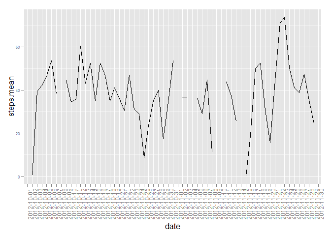

# Reproducible Research: Peer Assessment 1

## Loading Data
Data is Loaded from the working directory.


```r
setwd ("C:/Users/msolanoo/Documents/Coursera/Data Science/Reproducible Research")              
rawdata <- read.csv("activity.csv",header=TRUE)
```

## What is mean total number of steps taken per day?
#### Make a histogram of the total number of steps taken each day
Using Library "doBy", the calculated mean, median, max, min and std dev is calculated as a summary of steps in the timeframe date.
Null values were not taken into account


```r
library(doBy)
```

```
## Loading required package: survival
## Loading required package: splines
```

```r
data <- summaryBy(steps~date,data=rawdata, FUN=list(mean, median,max,min,sd))
hist(data$steps.mean, breaks=20, main="Distribution of Steps daily in 5 minutes intervals", xlab="Days", ylab="Steps", col="lightgreen")
```

 

#### Calculate and report the mean and median total number of steps taken per day

Next is the calculation of mean and median for the total number of steps taken per day

```r
subset(data, select=c("date", "steps.mean", "steps.median"))
```

```
##          date steps.mean steps.median
## 1  2012-10-01         NA           NA
## 2  2012-10-02  0.4375000            0
## 3  2012-10-03 39.4166667            0
## 4  2012-10-04 42.0694444            0
## 5  2012-10-05 46.1597222            0
## 6  2012-10-06 53.5416667            0
## 7  2012-10-07 38.2465278            0
## 8  2012-10-08         NA           NA
## 9  2012-10-09 44.4826389            0
## 10 2012-10-10 34.3750000            0
## 11 2012-10-11 35.7777778            0
## 12 2012-10-12 60.3541667            0
## 13 2012-10-13 43.1458333            0
## 14 2012-10-14 52.4236111            0
## 15 2012-10-15 35.2048611            0
## 16 2012-10-16 52.3750000            0
## 17 2012-10-17 46.7083333            0
## 18 2012-10-18 34.9166667            0
## 19 2012-10-19 41.0729167            0
## 20 2012-10-20 36.0937500            0
## 21 2012-10-21 30.6284722            0
## 22 2012-10-22 46.7361111            0
## 23 2012-10-23 30.9652778            0
## 24 2012-10-24 29.0104167            0
## 25 2012-10-25  8.6527778            0
## 26 2012-10-26 23.5347222            0
## 27 2012-10-27 35.1354167            0
## 28 2012-10-28 39.7847222            0
## 29 2012-10-29 17.4236111            0
## 30 2012-10-30 34.0937500            0
## 31 2012-10-31 53.5208333            0
## 32 2012-11-01         NA           NA
## 33 2012-11-02 36.8055556            0
## 34 2012-11-03 36.7048611            0
## 35 2012-11-04         NA           NA
## 36 2012-11-05 36.2465278            0
## 37 2012-11-06 28.9375000            0
## 38 2012-11-07 44.7326389            0
## 39 2012-11-08 11.1770833            0
## 40 2012-11-09         NA           NA
## 41 2012-11-10         NA           NA
## 42 2012-11-11 43.7777778            0
## 43 2012-11-12 37.3784722            0
## 44 2012-11-13 25.4722222            0
## 45 2012-11-14         NA           NA
## 46 2012-11-15  0.1423611            0
## 47 2012-11-16 18.8923611            0
## 48 2012-11-17 49.7881944            0
## 49 2012-11-18 52.4652778            0
## 50 2012-11-19 30.6979167            0
## 51 2012-11-20 15.5277778            0
## 52 2012-11-21 44.3993056            0
## 53 2012-11-22 70.9270833            0
## 54 2012-11-23 73.5902778            0
## 55 2012-11-24 50.2708333            0
## 56 2012-11-25 41.0902778            0
## 57 2012-11-26 38.7569444            0
## 58 2012-11-27 47.3819444            0
## 59 2012-11-28 35.3576389            0
## 60 2012-11-29 24.4687500            0
## 61 2012-11-30         NA           NA
```

## What is the average daily activity pattern?
#### Make a time series plot (i.e. type = "l") of the 5-minute interval (x-axis) and the average number of steps taken, averaged across all days (y-axis)

The time base plot is calculated using ggplot

```r
library("ggplot2")
ggplot(data=data, aes(x=date, y=steps.mean, group = 1)) + geom_line() + theme(axis.text = element_text(size = 6),axis.text.x = element_text(size = rel(1.5), angle = 90))
```

```
## Warning: Removed 2 rows containing missing values (geom_path).
```

 

#### Which 5-minute interval, on average across all the days in the dataset, contains the maximum number of steps?
November 22nd is when there is a larger number of steps

## Imputing missing values
#### Calculate and report the total number of missing values in the dataset (i.e. the total number of rows with NAs)

Since each interval has a gap of 5 minutes, in theory and by looking at the data set, each day there should be 288 data points.
The total missing data sets are:


```r
sum(is.na(rawdata$steps))
```

```
## [1] 2304
```

#### Devise a strategy for filling in all of the missing values in the dataset. The strategy does not need to be sophisticated. For example, you could use the mean/median for that day, or the mean for that 5-minute interval, etc.

The missing data which appears as "NA" is quite a lot. 2304/288= 8.  A total of 8 days.  By looking at the raw data, these days correspond to: 10/1, 10/8, 11/1, 11/4, 11/9, 11/10, 11/14 and 11/30.
The fcat of filling value with data for the same day is not possible, and using data from previous days would require some additional steps and thinking to make it feasible.  Therefore:  any data injected to the original data set will skew the data enough.  My take was just to make all NAs zero, which in subsequent questions also show how it changes the population.


```r
rawdata[is.na(rawdata)] <- 0
```

#### Create a new dataset that is equal to the original dataset but with the missing data filled in.


```r
data <- summaryBy(steps~date,data=rawdata, FUN=list(mean, median,max,min,sd))
```


#### Make a histogram of the total number of steps taken each day and Calculate and report the mean and median total number of steps taken per day. Do these values differ from the estimates from the first part of the assignment? What is the impact of imputing missing data on the estimates of the total daily number of steps?

The missing values represent around 13% of total data.  By replacing them with zeroes, the histogram shows to the lefet this large amount of previously non-considered data.  Therefore, if the data is not known, don't use it.  If the data set, becomes too small...go collect more data.


```r
hist(data$steps.mean, breaks=20, main="Distribution of Steps daily in 5 minutes intervals", xlab="Days", ylab="Steps", col="lightgreen")
```

 


## Are there differences in activity patterns between weekdays and weekends?

#### Create a new factor variable in the dataset with two levels -- "weekday" and "weekend" indicating whether a given date is a weekday or weekend day.

There are several ways to do this, my approach was simple and could have been more scientific...but, here it goes.

We first have a vector which compiles which dates were actually weekends.  The new column "IsWeekend" was created and calculated for all values whether or not they classify as Weekday and/or Weekend


```r
weekend <- c('2012-10-06','2012-10-07','2012-10-13','2012-10-14','2012-10-20','2012-10-21','2012-10-27','2012-10-27','2012-11-03','2012-11-04','2012-11-10','2012-11-11','2012-11-17','2012-11-18','2012-11-24','2012-11-25')

data$IsWeekend <- data$date %in% weekend
data$IsWeekend[data$IsWeekend == "TRUE"] <- "Weekend"
data$IsWeekend[data$IsWeekend == "FALSE"] <- "Weekday"
```


#### Make a panel plot containing a time series plot (i.e. type = "l") of the 5-minute interval (x-axis) and the average number of steps taken, averaged across all weekday days or weekend days (y-axis)

Using ggplot again in this case, and since we do have column for which we can plot for 2 different values, the "group= IsWeekend" splits the data accordingly.


```r
ggplot(data=data, aes(x=date, y=steps.mean, group = IsWeekend)) + geom_line() + geom_line(mapping = aes(y = steps.mean), lty = "dashed") + geom_line(mapping = aes(y = steps.mean), lwd = 1.3, colour = "red") + facet_wrap( ~ IsWeekend) + theme(axis.text = element_text(size = 8),axis.text.x = element_text(size = rel(1.5), angle = 90))
```

 

In order to answer this question properly, I would compare the means of the 2 populations (Weekdays and Weekends), by plotting them as box plots and running a t-test.  Just by looking at the time base plots, it is hard to say.  My take is, the look similar except for the fact that the missing NAs that I converted to zeroes make the chart look ugly in some areas.
